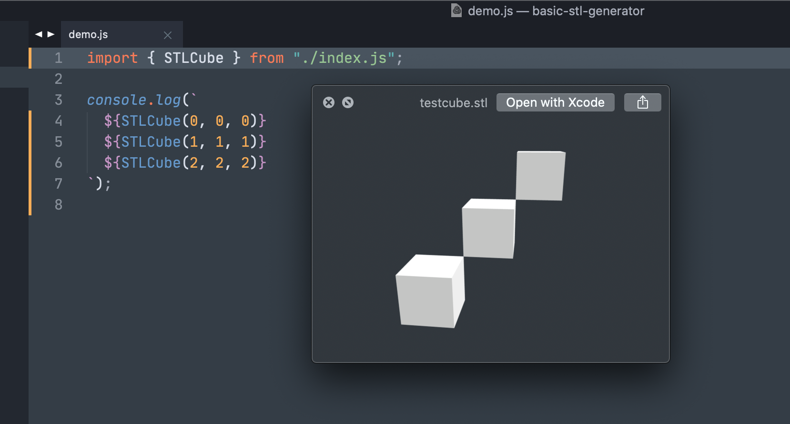

# Basic STL Generator

Util functions that generate ASCII STL solid strings. See example results in [sombras.app](https://sombras.app/).



## Getting Started

```
import { STLCube } from "basic-stl-generator";

console.log(`
  ${STLCube(0,0,0)}
  ${STLCube(1,1,1)}
  ${STLCube(2,2,2)}
`)

# To export to a file
# node index.js > testcube.stl
```

#### Exports

`STLCube(x = 0, y = 0, z = 0, size = 10)`

Returns a CUBE STL source for a cube using 12 triangular faces. X, Y, Z are the 3d coordinates.

## More info.

- [STLA Files - ASCII stereolithography files](https://people.sc.fsu.edu/~jburkardt/data/stla/stla.html).
